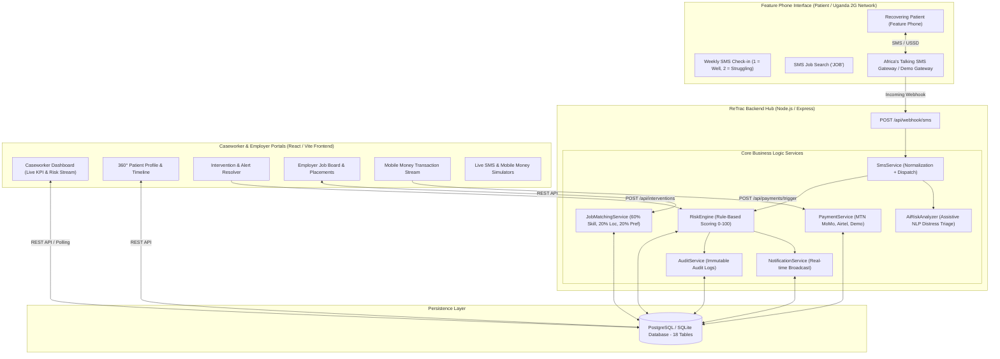

# ReTrac System Architecture & Design Specification

**DOMINION 2026 — Track 05: Rehabilitation & Reintegration**  
*Target Context: Uganda — Digital Aftercare, SMS/USSD Recovery Monitoring, AI Risk Detection, Reintegration Jobs & Mobile Money*

---

## 1. Executive Summary & Core Philosophy

> **"Build for the phone people already own, not the phone we wish they had."**

People leaving addiction treatment across East Africa (specifically Uganda) face high relapse rates during the critical 3 to 12 months post-discharge. While high-end smartphones are scarce and mobile data is often unaffordable or unavailable in peri-urban and rural areas (Kampala, Wakiso, Mukono, Jinja, Gulu), basic 2G feature phones and SMS/USSD networks are ubiquitous.

ReTrac solves this by bridging low-tech patient interactions (SMS/USSD check-ins) with modern clinical intelligence:
1. **Automated Weekly SMS/USSD Check-ins** requiring only single-digit replies (`1` = Doing well, `2` = Struggling) or optional free-text.
2. **Deterministic & Explainable Clinical Risk Engine** computing real-time risk scores (0–100) and classifications (`STABLE`, `MONITOR`, `AT_RISK`, `CRITICAL`).
3. **Assistive AI Free-Text Triage** detecting emotional distress and isolation without diagnosing or replacing human clinicians.
4. **Caseworker Intervention Hub** providing 360-degree patient timelines and alert resolution workflows.
5. **Reintegration Employment & Skill Matching Engine** matching recovering individuals to verified low-barrier employment (60% skills, 20% location, 20% category).
6. **Mobile Money Disbursal Engine** automating daily/weekly stipend payments via MTN MoMo and Airtel Money.

---

## 2. High-Level Architecture Diagram

---

## 3. Component Breakdown

### 3.1 Backend Service Layer (Business Hub)
The backend acts as the single source of truth:
- **`src/services/sms/smsService.js`**: Normalizes Ugandan phone numbers (`+256...`), handles automated check-in dispatch, incoming webhook routing, automated compassionate auto-replies, and USSD/SMS job query parsing.
- **`src/services/risk/riskEngine.js`**: Calculates deterministic risk weights (+25 on reply `2`, +15 on missed check-ins, +20 on consecutive struggling replies, +20 on NLP distress sentiment). Produces structured reason lists for clinical transparency.
- **`src/services/risk/aiRiskAnalyzer.js`**: Lightweight assistive NLP analyzer flagging distress indicators (`emotional distress`, `substance temptation`, `isolation`).
- **`src/services/matching/jobMatchingService.js`**: Multi-factor matching algorithm ranking jobs based on skills (60%), Ugandan districts (20%), and employment preferences (20%).
- **`src/services/payment/paymentService.js`**: Manages MTN Mobile Money and Airtel Money payout transactions with `RTR-2026-XXXXXX` reference generation and immutable audit trails.

### 3.2 Frontend Application (Modern Healthcare UX)
Built with React, Vite, Tailwind CSS, Lucide Icons, and Recharts:
- **Design Palette**: Deep Navy (`#0f172a`), Medical Teal (`#0d9488`), Sky Blue (`#0284c7`), Emerald (`#10b981`), Amber (`#f59e0b`), Rose/Crimson (`#ef4444`).
- **Interactive SMS Simulator (`/demo/sms`)**: Exercises the live backend webhook pipeline from within the browser to demonstrate 2G feature phone interactions.
- **Payment Simulator (`/demo/payment`)**: Tests full stipend payouts with real transaction reference assignment.

---

## 4. Security & Safeguards

1. **Role-Based Access Control (RBAC)**: Strictly separates `admin`, `caseworker`, and `employer` permissions.
2. **Password Protection**: BCrypt hashing with salt rounds.
3. **Clinical Assistive Boundary**: AI models do NOT diagnose addiction or replace healthcare professionals; they only triage free-text messages for human review.
4. **Data Privacy**: No patient medical records are exposed publicly; audit logs trace every data modification.
